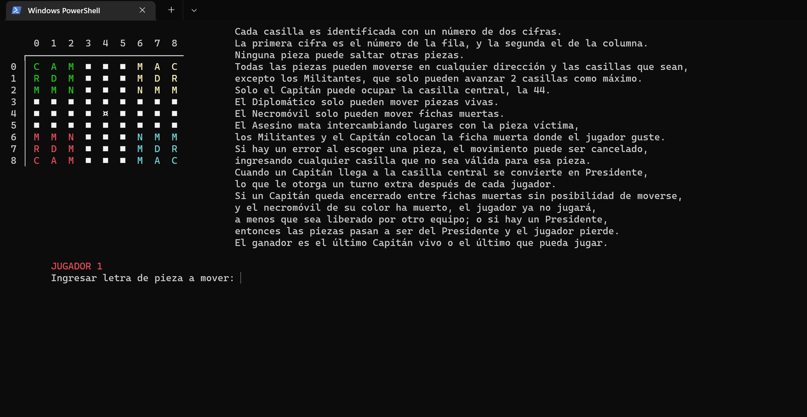

[**Djambi**](https://en.wikipedia.org/wiki/Djambi), also known as **Machiavelli's chessboard**, developed in Python 3 and adapted to play in Windows consoles.

This was a school project from 2018. It was my first project with Python so I warn you, the code smells like dead animal.
More than refactored it should be rewritten, I didn't even use OOP. But the game works! And you'd have to trust me because I didn't write any tests, at that time I didn't even know what a unit test was lol

The game is in Spanish.

Related projects, check them out!:
- [DjambiAI](https://github.com/Blizzsuxx/DjambiAI)

---

[**Djambi**](https://es.wikipedia.org/wiki/Djambi), también conocido como el **ajedrez de Maquiavelo**, programado en Python 3 y adaptado para jugar en consolas de Windows.

Para ver las instrucciones del juego, y ver cómo jugar en consola, revisa los [manuales](manuales/).

Las paquetes usados se listan en la [gráfica de dependencias](https://github.com/netotz/Djambi/network/dependencies) ([`requirements.txt`](../master/requirements.txt)). Para instalarlos:
 * En la consola de comandos ir al directorio del repositorio clonado
 * Introducir el comando: `pip install -r requirements.txt`

Instrucciones para jugar:
 * En la consola de comandos ir al directorio del repositorio clonado
 * Ir a la carpeta `src`
 * Introducir el comando: `python main.py`
